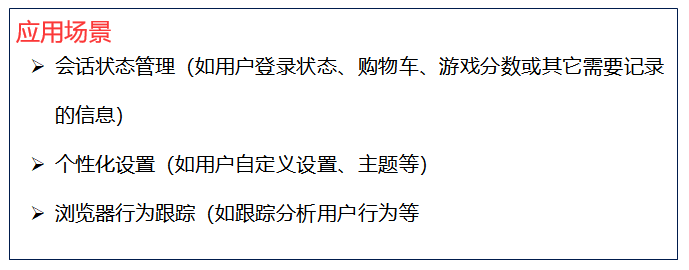
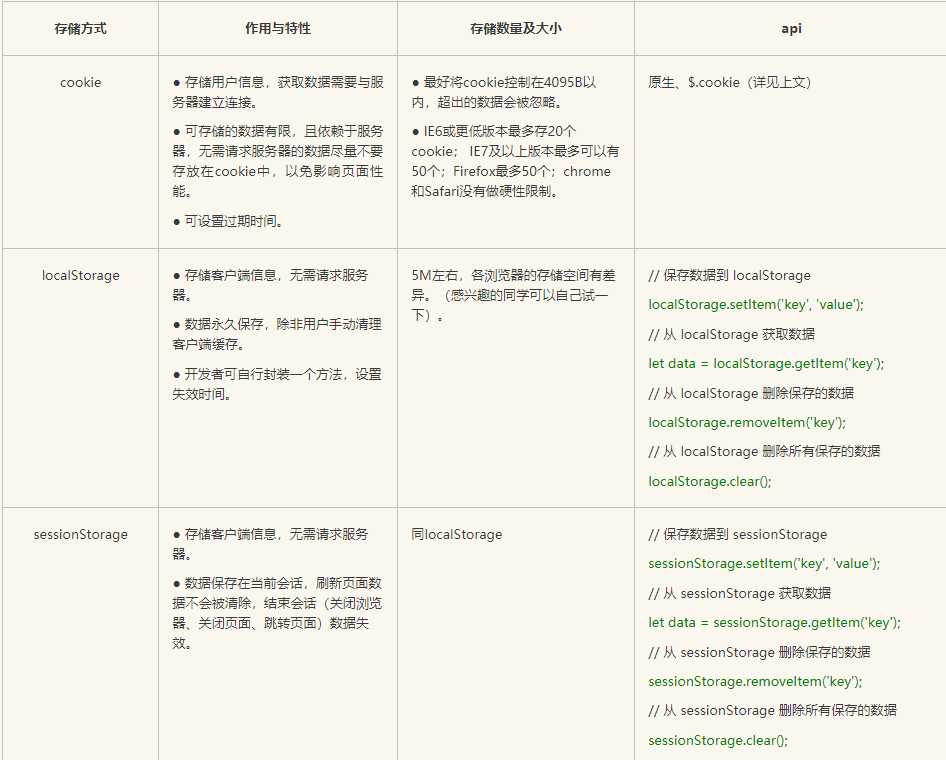

## 浏览器存储问题

常见且常用的存储方式主要有两种：cookie， webStorage(localStorage和sessionStorage)

前者保存在客户端浏览器，后者是本地存储，数据不需要服务器请求传递，可以存储大量数据（5M左右，依浏览器有所不同）

#### cookie

cookie是服务器发送到浏览器的一小段数据(限制在4K)，会在浏览器下一次向同一服务器再次发起请求的时候被携带并发送到服务器上。最初的作用是解决http的无状态请求，用来记录用户相关的状态。后来也被用于存储一些客户端的数据。

#### localStorage

生命周期是永久性的，即使关闭浏览器，它存的数据也不会消失，除非主动删除，或者设置失效时间也可。

#### sessionStorage

生命周期是在浏览器关闭前。

① 关闭浏览器就失效；

②页面刷新不会消除数据；

