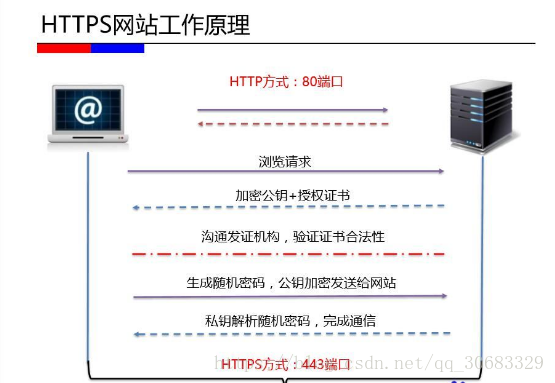
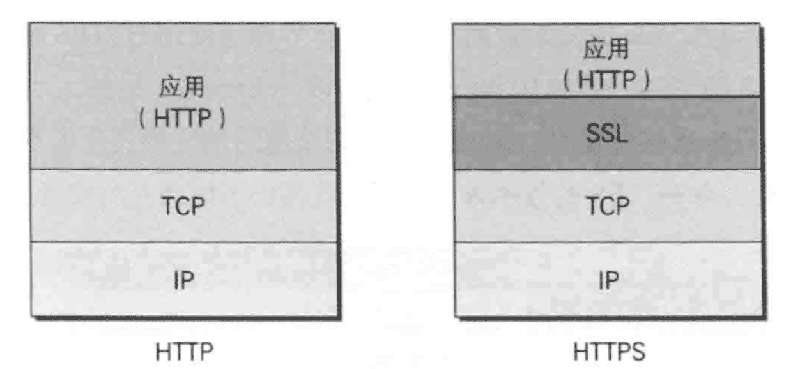
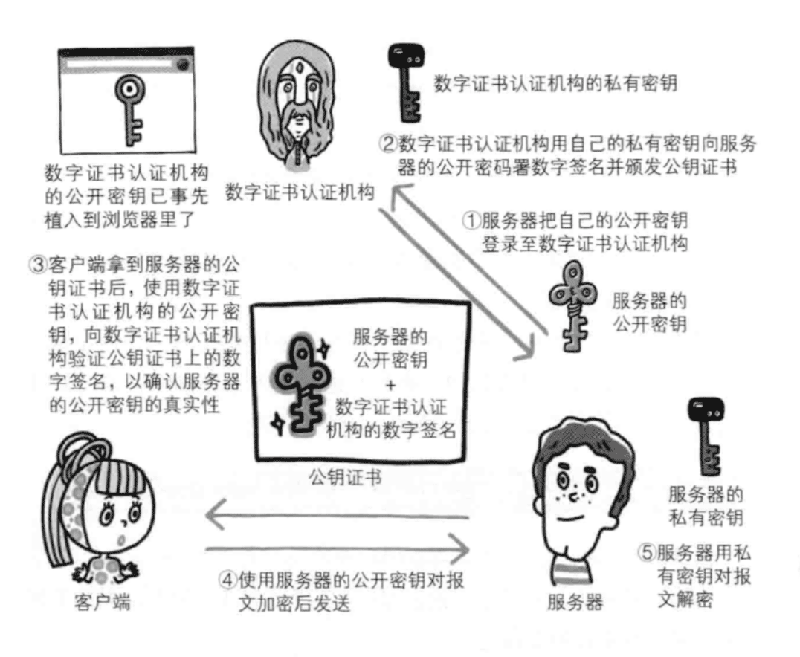
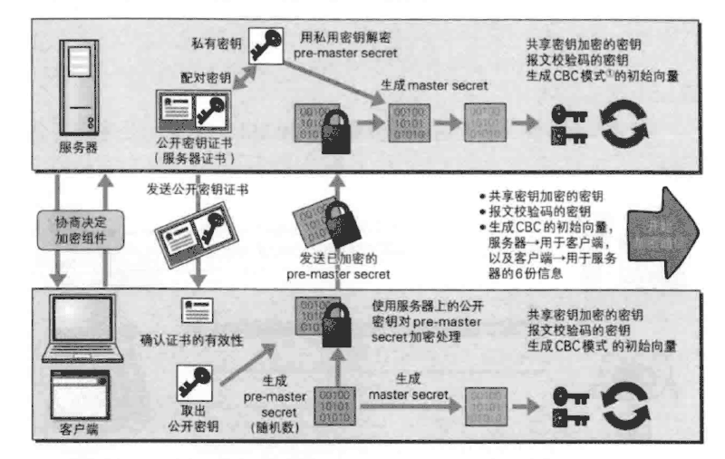

## https的特点及原理

谈到https，一般是俩方面去说，第三方接入认证，和传输加密。

1. https是在http协议的基础上发展出来的。加入了SSL(Secure Sockets Layer [安全套接层](https://baike.baidu.com/item/安全套接层))或者TLS（Transport Layer Security [传输层安全](https://baike.baidu.com/item/传输层安全)），是为网络通信提供安全及数据完整性的一种安全协议，TLS与SSL在[传输层](https://baike.baidu.com/item/传输层/4329536)与应用层之间对网络连接进行加密。

   ​      1、认证用户和服务器，保证各自的数据都发送到正确的位置上去。

   ​      2、对发送的数据进行加密，保护数据。

   ​      3、保证数据在发送过程中的完整性。

http是超文本传输协议，信息是明文传输，

https 则是具有安全性的ssl加密传输协议。

**HTTP + 加密 + 认证 + 完整性保护 = HTTPS**           ”身披SSL外壳的HTTP“

https是在http协议的基础上发展出来的。加入了SSL(Secure Sockets Layer [安全套接层](https://baike.baidu.com/item/安全套接层))或者TLS（Transport Layer Security [传输层安全](https://baike.baidu.com/item/传输层安全)），是为网络通信提供安全及数据完整性的一种安全协议，TLS与SSL在[传输层](https://baike.baidu.com/item/传输层/4329536)与应用层之间对网络连接进行加密。

​      1、认证用户和服务器，保证各自的数据都发送到正确的位置上去。

​      2、对发送的数据进行加密，保护数据。

​      3、保证数据在发送过程中的完整性。

#### **http缺点：**

（1）通信使用明文,内容可能被窃听

（2）不验证通信方身份,因此有可能遭遇伪装

（3）无法验证报文的完整性,有可能已篡改

（4）http重要的缺点是其用户端和客户端之间的数据一旦被抓包，其相关的交互信息就会被泄露，传输过程不加密。

#### https传输过程简述

- 首先 https 服务端必须要拥有一个**CA认证合法授权的证书**，没有这个证书，客户端在访问该服务器时就会提醒用户这个网站是不受信任的。只有通过CA认证的服务器才是可靠的，这保证了用户在访问服务器的安全性。浏览器会保持一个信任的CA机构列表，通过这些机构出查询所访问的服务器提供的证书是否合法。

- 如果此时发现证书是合法OK的，那么就从这个服务器端的证书中获取到了**加密密钥**，这个加密密钥会沟通商议出一个**随机的对称密钥**，服务端再传输信息时使用该密钥进行加密。而客户端在收到这部分信息后，在浏览器侧通过之前得到的对称密钥进行解密，相反如果客户端想要向服务端发送消息时也是如此。

- 

- HTTPS工作原理：客户端发起https请求、服务端配置、传送证书（公钥）、客户端解析证书、传送加密信息、服务端解密信息、传输加密后的信息、客户端解密信息

- 通常情况下HTTP是直接和TCP层进行通信的。

  当使用SSL时,则演变成**HTTP先和SSL通信,SSL再和TCP通信**的了。

  

SSL采用的是一种叫做**公开密钥加密**的加密处理方式

**对称加密：**加密和解密用的一个密钥的方式称为对称加密,也叫做**共享密钥加密**

对称加密在发送加密信息时也需要将密钥发送给对方,但这样可以被攻击者截取,不安全：

客户端将信息按照密钥进行加密操作，并将加密信息和加密后的密钥传输给服务器，服务器使用传递来的密钥解密加密信息。

**非对称加密：**又称作**公开密钥加密**，解决了对称加密密钥被截取的问题。

非对称加密采用一对非对称的密钥,一把叫做私有密钥,一把叫做共有密钥。

发送密文一方使用共有密钥进行加密处理,对方收到加密信息,再使用自己的私有密钥进行解密。

服务端将公钥发送给客户端，客户端使用公钥加密信息，并将加密信息发送给服务端，服务端使用私钥对加密信息进行解密。

**HTTPS采用混合加密机制**

①使用公开密钥加密方式安全地交换在稍后的共享密钥加密中要使用的密钥

②确保交换的密钥是安全的前提下，使用共享密钥加密方式进行通信

在内容传输上使用对称加密，在证书验证上使用非对称加密。

#### 公开密钥的认证

原因：

用于确定信息的完整以及没有篡改，并且确定信息是从客户端发出的。

非对称密钥加密，公钥有可能被挟持，客户端无法确认接收到的公钥是否为服务端传来的。
服务器的开发者将公钥向第三方可信赖数字证书认证机构提出申请，第三方数字证书认证机构通过审核后，会对开发者申请的公钥做数字签名，然后分配已签名公钥，并将公钥放在证书中，服务器将数字证书发给客户端，客户点通过数字证书中的数字签名来验证公钥真伪，确保公钥是真实的。

url向CA申请证书、CA生成一对公钥A和私钥B，CA有自己的公钥C和私钥D，CA把公钥A,个人信息等信息以明文的形式写到证书里面，然后用一个指纹算法计算出这些数字证书内容的一个摘要，并把摘要和指纹算法用自己的私钥D进行加密，然后和证书的内容一起发给url。
通信时，先将证书发送给客户端，客户端拿到证书进行解析，获取公钥等信息，权威机构进行身份验证。

私有密钥是保存在服务器端的

#### 完整的HTTPS通信过程

**优点：**

相比于http，https可以提供更加优质保密的信息，保证了**用户**数据的安全性，此外https同时也一定程度上保护了**服务端**，使用恶意攻击和伪装数据的成本大大提高。

**缺点：**

（1）技术门槛高，CA机构颁发证书需要年费，额外的技术支持；

（2）很多网站不关心数据安全性保密性；

（3）加重了服务端负担，相比于http其需要更多的资源来支撑，同时也降低了用户的访问速度；

1）使用https的url访问服务器，建立SSL链接
2）服务器接受SSL链接，发送证书和非对称加密公钥1给浏览器
3）浏览器验证公钥并生成随机数作为对称加密的密钥2
4）浏览器使用公钥1对密钥2加密，得到密钥3
5）密钥3发给服务器
6）服务器使用私钥4对密钥3解密得到密钥2
7）使用密钥2通信

