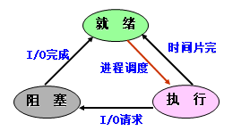

## 进程和线程（字节）

##### 进程：

1. 定义：程序关于某个数据集合的一次执行过程。
2. 特征：

（1）结构特征：进程控制快（PCB）+ 程序 + 数据 = 进程实体

（2）动态性——最基本特征

​		进程：进程实体的一次执行过程，有生命周期

​		程序：程序是一组有序 指令的集合，是静态的概念

（3）并发性

（4）独立性

（5）异步性：进程按各自独立的、不可预知的速度向前推进

3. 进程的基本状态：

(1)就绪状态(Ready)：进程已获得除CPU之外的所有必需的资源，一旦得到CPU控制权，立即可以运行。

(2)运行状态(Running)：进程已获得运行所必需的资源，它的程序正在处理机上执行。 

(3)阻塞状态(Blocked)： 正在执行的进程由于发生某事件而暂时无法执行时，便放弃处理机而处于暂停状态，称该进程处于阻塞状态或等待状态。

（4）挂起状态：

引起挂起状态的原因：终端用户的请求； 父进程请求； 负荷调节的需要； 操作系统的需要

4. 引入进程的目的：使多个程序能并发执行，提高资源利用率和系统吞吐量

##### 线程：

线程是进程的一条执行路径，它包含独立的堆栈和CPU寄存器状态，每个线程共享其所附属的进程的所有的资源，包括打开的文件、页表（因此也就共享整个用户态地址空间）、信号标识及动态分配的内存等等。

引入线程的目的：减少程序在并发执行时所付出的时空开销，使OS具有更好的并发性。

线程的状态：执行状态、就绪状态、阻塞状态

##### 线程和进程的关系：

线程是属于进程的，线程运行在进程空间内，同一进程所产生的线程共享同一物理内存空间，当进程退出时该进程所产生的线程都会被强制退出并清除。

在多线程OS中，通常一个进程包括多个线程，每个线程是利用CPU的基本单位，是花费最小开销的实体。

在多线程OS中，进程是作为拥有系统资源的基本单位，通常进程都包含多个线程并为它们提供资源，但进程不再作为一个执行的实体。